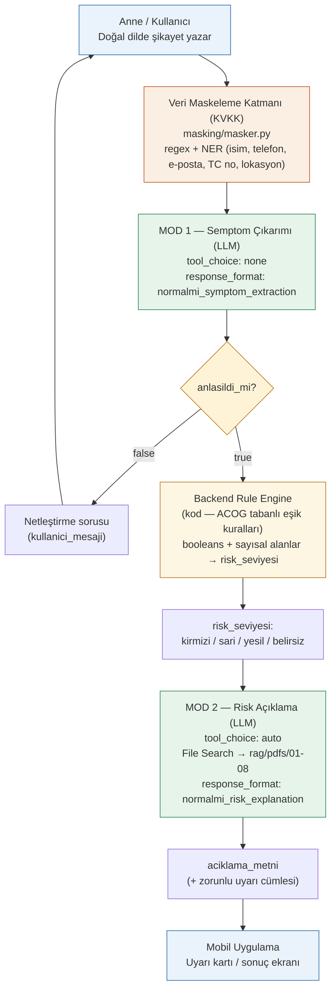

# Sistem Mimarisi — "Normal mi?" Akıllı Asistanı

## Genel Bakış

Sistem, LLM'in tıbbi risk kararı vermesini engelleyen, iki modlu bir hibrit
mimari kullanır:

- **MOD 1 (LLM):** Serbest metni yapılandırılmış semptom verisine çevirir. Risk kararı vermez.
- **Backend Rule Engine (kod, LLM değil):** ACOG tabanlı kurallara göre risk seviyesini (kırmızı/sarı/yeşil/belirsiz) belirler.
- **MOD 2 (LLM):** Backend kararını, File Search'teki referans dokümanlarla birlikte, empatik bir dille kullanıcıya açıklar. Kararı değiştiremez.

## Akış Diyagramı

## Bileşen sorumlulukları

| Bileşen | Sorumluluk | Risk kararı verir mi? |
|---|---|---|
| `masking/` | Kişisel veriyi LLM'e ulaşmadan temizler | Hayır |
| MOD 1 (LLM) | Serbest metni yapılandırılmış veriye çevirir | **Hayır** |
| Backend Rule Engine | ACOG kurallarına göre risk seviyesi belirler | **Evet — tek karar verici** |
| MOD 2 (LLM) | Kararı File Search referanslarıyla açıklar | Hayır (sadece iletir) |
| Mobil uygulama | Sonucu kullanıcıya gösterir | Hayır |

Bu ayrım, görev tanımındaki "yapay zekayı tamamen serbest bırakmak yerine
hibrit sistem" gereksinimini karşılar: LLM hiçbir noktada tek başına tıbbi
karar vermez.

## Neden iki ayrı LLM çağrısı (MOD 1 / MOD 2) ve tek çağrı değil?

Tek çağrıda hem çıkarım hem açıklama yaptırmak, modelin aynı anda hem veri
çıkarıp hem de örtük şekilde risk değerlendirmesi yapmasına (ör. "bu ciddi
görünüyor" gibi sızıntılara) yol açabilir. İki ayrı çağrı ve iki ayrı şema,
"LLM sadece anlıyor, karar motoru karar veriyor" ayrımını API seviyesinde
zorunlu kılar.

## İlgili dosyalar
- Kurulum adımları → `Installation.md`
- Genel teknik özet → `Technical_Documentation.md`
- JSON şemaları → `../../assistant/JSON_API_Contract.md`
